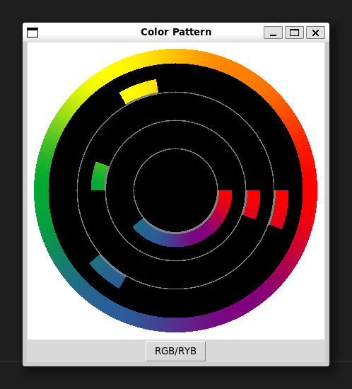
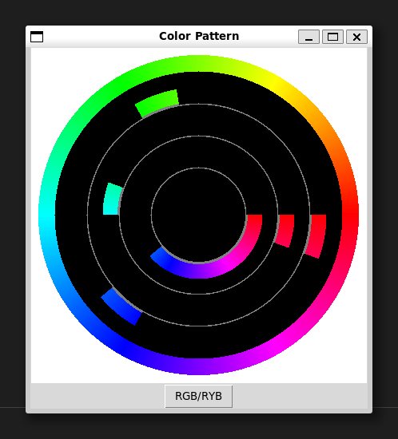

# My Colour Pattern

I created this little tool to use while painting and choosing colour patterns

<div style="display: flex; justify-content: center; gap: 20px;">
  <figure style="text-align:center;">
    
    <figcaption style="text-align:center;">RYB Colour Wheel</figcaption>
  </figure>
  <figure style="text-align:center;">
    
    <figcaption style="text-align:center;">RGB Colour Wheel</figcaption>
  </figure>
</div>

- The wheel has both RGB and RYB modes, changeable by toggle the button. 
- The pattern shows from inner to outer layers: 
- 1. Continuous colours
  2. Two complementary Colours
  3. Three triadic colours
- Drag the disk with mouse to rotate the disk and show different patterns. 

## Dependency

No external packages ourside the standard library are required. 

## How to run: 

```
python MyColourPattern.py
```